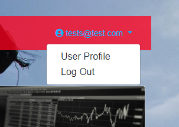
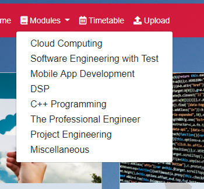

# Noodle
A student file sharing website with Node.js backend. Mini-project for Cloud Computing module.

---
# Webpage Navigation
A step-by-step documentation on how to to navigate through the Noodle webpage.

## Welcome
To run the program, make sure you are in the same directory as app.js and run the following in your command terminal:
```
npm start
```

Open up a browser and connect to **_localhost:3000_** to view the webpage.


**AWS is now configured to run the Noodle webpage, refer to webpage creator for link.**

## User Profile
Individual user profile can be configured for a more personalised access. 

If you do not have a profile set up, click **_Register_** to create a new user profile.


Otherwise, you can just **_Sign In_**


Once you have signed in, the email address associated with your Noodle account will appear on the _top-right hand corner_. By clicking this, you will get a dropdown menu to view profile or to logout.




## Features
The Noodle Homepage lists out a variety of subjects available. For the purpose of this project, only the modules in Semester Two of final year Software and Electronic Engineering are currently available.


### Modules
You can also view the complete list of modules in the navigation bar under **_Modules_**.



Navigate to a module by simply clicking its title to view files.


Currently, no files are available. 

### File Upload
Since Noodle is a student sharing page, you can share module contents through the upload feature. This feature can be accessed in the navigation bar under **_Upload_**


Select which module to upload your file in by defining this in th3 dropdown menu.

Click **_Choose File_** to select a file from your File Explorer.


Once uploaded, a confirmation page will show.


You can re-navigate to the module to view the uploaded file. These can later be downloaded by other users.

### Timetable and Download
You can also access your current timetable for the semester under the **_Timetable_** feature.


Similar to the files, the timetable can also be downloaded.

---
